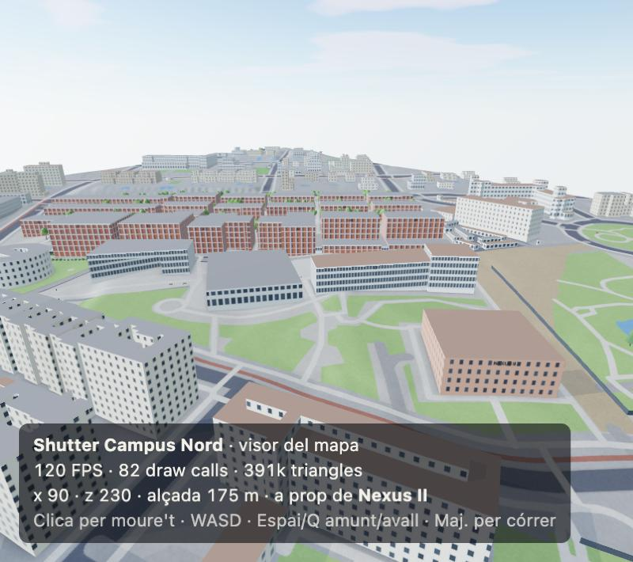

# Shutter Campus Nord

Shooter 3D multijugador que es juga des del navegador, ambientat en una recreació fidel del **Campus Nord de la UPC** (Barcelona).
El mapa es genera a partir de dades reals: edificis, camins, arbres i mobiliari d'OpenStreetMap, i relleu del model d'elevacions de l'ICGC.



> **Estat:** en desenvolupament. Les fases 0 (esquelet) i 1 (mapa) estan fetes; la fase 2 (FPS en solitari) està en curs.
> Vegeu el [full de ruta](docs/ROADMAP.md).

## Com provar-ho

Cal **Node.js 24 o superior** (el servidor i les eines fan servir el TypeScript natiu de Node).

```bash
npm install
npm run dev
```

Obre <http://localhost:5173>. De moment hi ha el visor del mapa: clica per capturar el ratolí, mou-te amb **WASD**, **Espai/Q** per pujar i baixar i **Maj.** per anar ràpid.

| Ordre | Què fa |
| --- | --- |
| `npm run dev` | Servidor de joc (port 3000) + client Vite (port 5173) amb recàrrega automàtica |
| `npm test` | Tests (Vitest) |
| `npm run typecheck` | Comprovació de tipus de tots els paquets |
| `npm run build` | Build de producció del client (`apps/client/dist`) |
| `npm start` | Servidor de producció: serveix el client compilat i el WebSocket |
| `npm run map:import` | Regenera `assets/maps/campus-nord.json` des d'OSM i l'ICGC (`-- --refresh` per tornar a descarregar) |

## Estructura

```
packages/shared/    codi comú client + servidor (mapa, geometria, simulació, protocol)
apps/client/        joc al navegador: Vite + Three.js
apps/server/        servidor autoritatiu: Node + ws (+ Rapier)
tools/map-import/   importador OSM + terreny ICGC → assets/maps/campus-nord.json
assets/maps/        mapa generat (dades ODbL)
docs/               full de ruta, arquitectura i imatges
```

Més detalls a [docs/ARCHITECTURE.md](docs/ARCHITECTURE.md).

## Col·laborar

Hi treballem diverses persones, cadascuna amb el seu agent d'IA. Llegiu primer [CONTRIBUTING.md](CONTRIBUTING.md); les instruccions per als agents són a [AGENTS.md](AGENTS.md).

## Llicències i atribucions

- **Codi:** [MIT](LICENSE).
- **Dades del mapa** (`assets/maps/`): deriven d'OpenStreetMap i es distribueixen sota la [Open Database License (ODbL)](assets/maps/LICENSE.md).
  - © [OpenStreetMap contributors](https://www.openstreetmap.org/copyright).
  - Model d'elevacions del terreny © [Institut Cartogràfic i Geològic de Catalunya](https://www.icgc.cat) (CC BY 4.0).
